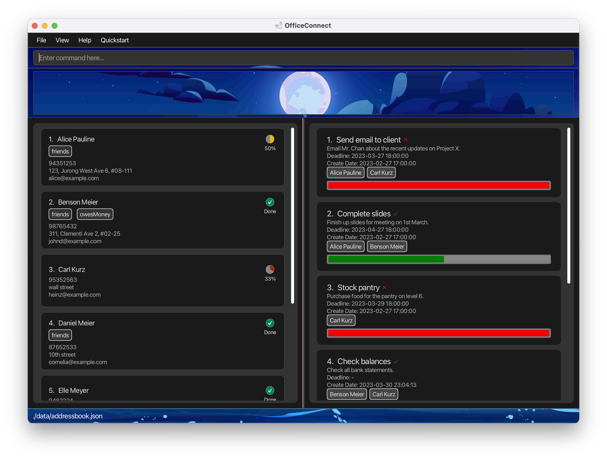

# OfficeConnect

## Description
OfficeConnect is a task management tool tailored to meet the needs of managers working in corporate settings. 
In today's office environment, it can be challenging for managers to keep track of the workload of their subordinates,
which can lead to work overload and coordination issues among employees. Additionally, administrative tasks such as 
sending emails can consume valuable time and resources.

OfficeConnect addresses these problems by providing managers with enhanced visibility into their subordinates' 
workloads. This enables managers to delegate tasks efficiently and in an organized manner. With OfficeConnect, 
managers can streamline their task management process, which leads to improved productivity and a more effective 
and productive work environment.

## Features overview

Our features can be broadly divided into 6 categories:
1. Utility Commands - Commands that assist the user in operating OfficeConnect.
2. Person Commands - Commands that involve Persons stored in OfficeConnect.
3. Task Commands - Commands that involve Tasks stored in OfficeConnect.
4. Assignment Commands - Commands that involve assignment of Tasks to Persons.
5. Filter Commands - Commands that involve filtering Tasks or Persons.
6. Others - Miscellaneous commands 

For a more comprehensive list of our commands, please refer to our [User Guide](https://ay2223s2-cs2103-f10-1.github.io/tp/UserGuide). 

## Getting Started

- Check out our [OfficeConnect Website](https://ay2223s2-cs2103-f10-1.github.io/tp/).
- Check out our [User Guide](https://ay2223s2-cs2103-f10-1.github.io/tp/UserGuide).
- Check out our [Developer Guide](https://ay2223s2-cs2103-f10-1.github.io/tp/DeveloperGuide)
- Download our latest release from [OfficeConnect Release Page](https://github.com/AY2223S2-CS2103-F10-1/tp/releases)

## Contributing

This project is a part of the se-education.org initiative. If you would like to contribute code to this project, see [se-education.org](https://se-education.org#https://se-education.org/#contributing) for more info.

## License

This project is licensed under the [MIT License](LICENSE).

## Acknowledgments

- Icons and images
  - [ICONS8](https://icons8.com/)
  - [freepik](https://www.freepik.com/)

* This project is based on the AddressBook-Level3 project created by the [SE-EDU initiative](https://se-education.org).
* This is a sample project for Software Engineering (SE) students.
  * As a starting point of a course project (as opposed to writing everything from scratch)
  * As a case study
* The project simulates an ongoing software project for a desktop application (called _AddressBook_) used for managing contact details.
  * It is written in OOP fashion. It provides a reasonably well-written codebase that is bigger (around 6 KLoC) than what students usually write in beginner-level SE modules, without being overwhelmingly big.
  * It comes with a reasonable level of user and developer documentation.
* It is named `AddressBook Level 3` (`AB3` for short) because it was initially created as part of a series of `AddressBook` projects (`Level 1`, `Level 2`, `Level 3`, etc.).
* For detailed documentation of this project, see the [Address Book Product Website](https://se-education.org/addressbook-level3).
