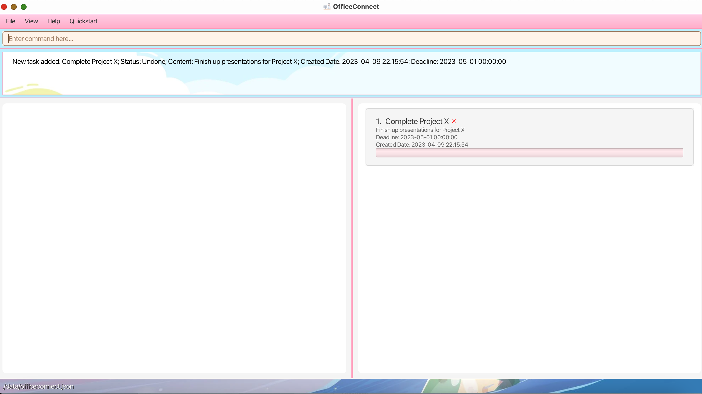
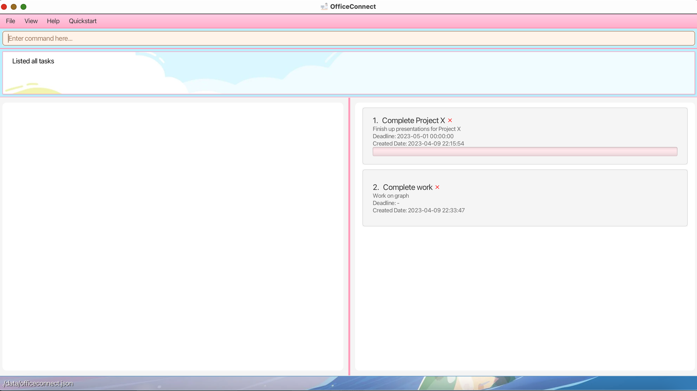
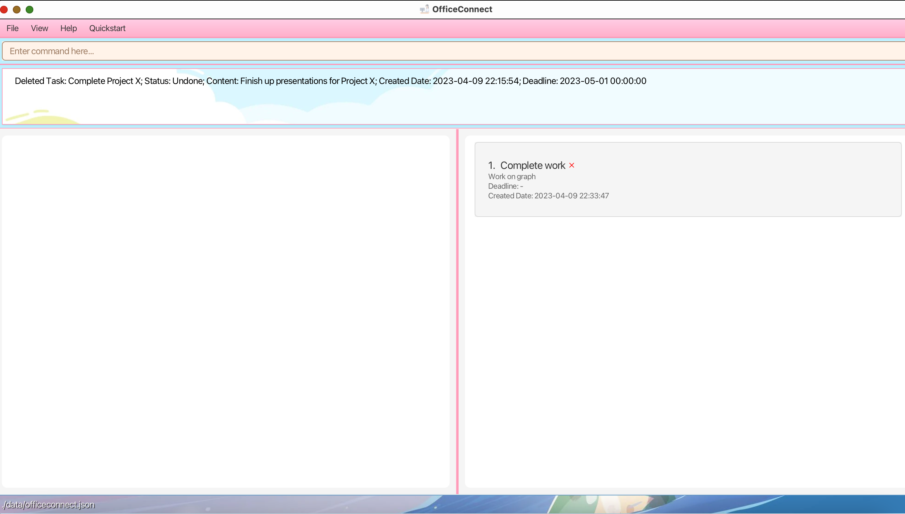

### Project: OfficeConnect

OfficeConnect is a task management tool designed specifically for managerial role personnel at companies. The target
users are managers who are responsible for assigning tasks and overseeing the work of a team.

The product addresses several challenges faced by managers in the current office environment, including but not limited
to difficulty in coordinating tasks among a large number of subordinates, possible work overload of any single
subordinate within a huge team and hassle of manually typing and sending out emails.

OfficeConnect offers a solution to these problems by providing better visibility into subordinates' workloads and
allowing managers to efficiently delegate tasks in an organised and centralised manner. It also removes the manual
aspect of sending emails, as mass emails can be automated and sent with just a simple command!

Given below are my contributions to the project.

- **New Feature**: Add task for OfficeConnect.
   
  * What it does: With this new feature, users can add tasks to OfficeConnect
  * Justification: This feature is instrumental, as it allows users to create tasks that are stored into the storage of OfficeConnect. This creates the foundation for subsequent task commands, such as delete task or assign task
  * Highlights: Users who are quick at typing will be able to add tasks quickly following the syntax specified in the UserGuide
- **New Feature**: List tasks for OfficeConnect
  
  * What it does: With this new feature, users can see all tasks stored in OfficeConnect
  * Justification: This feature is vital, as it allows users to keep track of current tasks stored in OfficeConnect. This helps users better visualise their workload and efficiently delegate the tasks.
  * Highlights: This feature is necessary as it keeps track of the index of all tasks and can be called to retrieve the index of the task, which will be used when deleting tasks.
- **New Feature**: Delete tasks for OfficeConnect
  
  * What it does: With this new feature, users can remove tasks stored in OfficeConnect
  * Justification: This feature is vital, as it allows users to remove unnecessary tasks, such as tasks that are completed or cancelled.
  * Highlights: This feature also ensures that storage size is kept to a minimum, as unnecessary tasks can be removed
- **New Feature**: Filter persons for tag in OfficeConnect.
  
  * What it does: With this new feature, users can search for users with the specified tag.
  * Justification: This feature is very handy, when considering the purpose of OfficeConnect in the office setting. In an office setting, there are many different departments (e.g Logistics, Marketing etc). Employees can be tagged with their department and this command allows users to quickly and easily view all employees of a specific department through filtering their tag, which improves convenience and accessibility for users. 

- **Code contributed**: [RepoSense link](https://nus-cs2103-ay2223s2.github.io/tp-dashboard/?search=nicklelodeon&sort=groupTitle&sortWithin=title&timeframe=commit&mergegroup=&groupSelect=groupByRepos&breakdown=true&checkedFileTypes=docs~functional-code~test-code~other&since=2023-02-17)

- **Project management**: 
  * Provided timely reminders when approaching both internal and external project deadlines. 
  * Coordinated group meetings and helped document project discussions in the collaborative docs. 
  * Participated actively during group discussions, through providing help and opinions to my group mates when necessary, as well as seeking help from them.

- **Enhancements to existing features**:
  * Added a command to filter persons according to their tag, as described above. Previously, there was no way for users to search for tags, which meant that they had to scroll through all the persons individually to find out which persons had a specified tag. 
    This would be especially time-consuming if there were many persons stored in OfficeConnect. Hence, I decided to add a filter function for tag to improve the convenience of tag searching and provide more purpose for the tag label, which will in turn encourage more users
    to add tags when necessary. With the addition of this command, tags are evolved from a mere cosmetic feature to a powerful filtering feature. 

- **Documentation**:
- Developer Guide:
  * Authored sections in the DG related to the features I have implemented, namely adding a task, deleting a task, listing all tasks and filtering persons according to tag. Listed below are the sections that I have authored  
    3.1 Adding a Task , 3.2 Deleting a Task, 3.9 List all Tasks, 3.10 Filter Persons according to tag in the DG, 6.3.3 Use case 3: Delete a task, 6.3.7 Use case 7: Add a task, 6.3.8 Use case 8: List all Tasks, 6.3.13 Use case 13: Filter Persons based on tag, 7.6 Adding a task, 7.7 Deleting a task, 7.8 Listing all tasks, 7.9 Filtering persons by tag. 
  * Updated old AB3 diagrams in the DG to fit the new OfficeConnect structure.

- User Guide:
  * Authored sections in the UG related to the features I have implemented, namely adding a task, deleting a task, listing all tasks and filtering persons according to tag. Listed below are the sections that I have authored  
    1.2 Prefixes used in commands, 3.3.1 Adding a Task, 3.3.2 Deleting a Task, 3.3.4 Listing the Tasks, 3.6.8 Filter Persons.
  * Updated Command Summary table and vet through contents of the UG to ensure it is thorough and fits the requirements. 

- Other aspects: 
  * Contributed to documentation of group discussions in the group collaborative docs. 
  * Assisted in PR reviews and suggested improvements on documentation where necessary. 
  * Updated README to include links to our UserGuide, DeveloperGuide and provide feature overview of the features in OfficeConnect. 
  * Added details on myself in AboutUs. 

- **Community**:
  * Reviewed PRs of peers: [\#57](https://github.com/AY2223S2-CS2103-F10-1/tp/pull/57), [\#59](https://github.com/AY2223S2-CS2103-F10-1/tp/pull/59), [\#75](https://github.com/AY2223S2-CS2103-F10-1/tp/pull/75), [\#83](https://github.com/AY2223S2-CS2103-F10-1/tp/pull/83), [\#110](https://github.com/AY2223S2-CS2103-F10-1/tp/pull/110), [\#114](https://github.com/AY2223S2-CS2103-F10-1/tp/pull/114), [\#131](https://github.com/AY2223S2-CS2103-F10-1/tp/pull/131), [\#133](https://github.com/AY2223S2-CS2103-F10-1/tp/pull/133).
  * Created issues on github on areas we need to work on and relevant User Stories, assisted in adding relevant tags and deadlines to issues and assigning these issues to the people in charge of it. 

